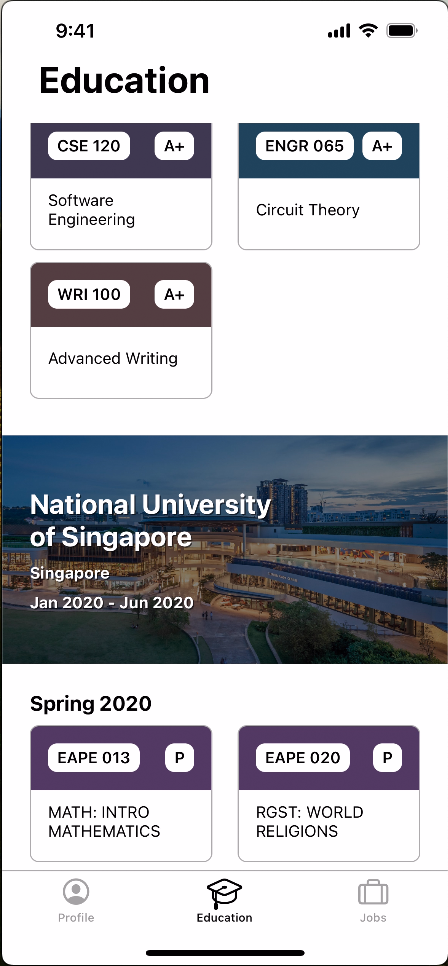

<!--
*** Thanks for checking out the Best-README-Template. If you have a suggestion
*** that would make this better, please fork the repo and create a pull request
*** or simply open an issue with the tag "enhancement".
*** Don't forget to give the project a star!
*** Thanks again! Now go create something AMAZING! :D
-->

<!-- PROJECT SHIELDS -->
<!--
*** I'm using markdown "reference style" links for readability.
*** Reference links are enclosed in brackets [ ] instead of parentheses ( ).
*** See the bottom of this document for the declaration of the reference variables
*** for contributors-url, forks-url, etc. This is an optional, concise syntax you may use.
*** https://www.markdownguide.org/basic-syntax/#reference-style-links
-->
[![LinkedIn][linkedin-shield]][linkedin-url]

<!-- PROJECT LOGO -->
 

    
<h3 align="center" style="font-size:24px;">Cartera</h3>

  

    A resume application.   "Cartera" is a digital wallet containing a small snapshot of information.
  

<!-- ABOUT THE PROJECT -->
### About The Project

The application is written in UIKit using auto layout. The UI is flexible and all the informatiton comes from JSON files that can be modified to update the UI content. 

The application is built following MVVM to enforce separation of concerns. 

    
    
    
    
    
    

<!-- MARKDOWN LINKS & IMAGES -->
<!-- https://www.markdownguide.org/basic-syntax/#reference-style-links -->
[linkedin-shield]: https://img.shields.io/badge/-LinkedIn-black.svg?style=for-the-badge&logo=linkedin&colorB=555
[linkedin-url]: https://www.linkedin.com/in/ricardo-sanchez-macias/
[product-screenshot]: images/screenshot.png

